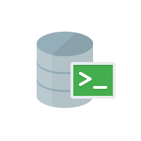

# SQLcl - Scripting

## What is it?

SQLcl scripting is based on Java's [JSR-223](https://jcp.org/aboutJava/communityprocess/final/jsr223/index.html) which allows scripting languages to be executed from the Java VM.  There are a number of languages that can be plugged in with the NashHorn Javascript engine being included in Java.  A list of languages can be found [here](https://en.wikipedia.org/wiki/List_of_JVM_languages)

The addition of client side scripting will allow control flow in the sql scripts themselves.  It also allow for things like file access, greater control on host commands, leverage various javascript libraries, and the ability to leverage java.

## Globals

There are a few globals pushed into the scripting engine for use.

**args** -This is a simple array of the arguments passed along

Example:

~~~	
		for(var arg in args) {
		   ctx.write(arg + ":" + args[arg]);
		   ctx.write("\n");
		}
~~~

 **sqlcl** - This is SQLCL itself
 
~~~
setStmt(<String of stuff to run>)
			This can be a single statement, an entire script of stuff, or any sqlcl command such as "@numbers.sql"
~~~

~~~			
run() 
		Runs whatever is set via the setStmt function
~~~

Example:

~~~		
		/* Run any amount of command in the sqlcl prompt */
		sqlcl.setStmt("select something from somewhere; @myscript \n begin null;end;");

		sqlcl.run();
~~~

   **ctx** ( this has tons of methods but this is the single most important )

~~~
write(<String>)
~~~
Example:

~~~		
		ctx.write('Hello World');
~~~

   **util** ( again tons of methods ) 
   
~~~
execute(<string>,binds)
      executes whatever is passed in with a boolean return for success/failure
~~~                   
~~~
executeReturnOneCol(<string>,binds)
      executes and returns the first row , first column
~~~

~~~
executeReturnListofList(<string>,binds)
      executes and returns an array(rows) of arrays(row).  
~~~
~~~                   
executeReturnList(<string>,binds)
      execute and returns and array ( rows ) of objects ( row )
~~~       

Examples:  [sql.js](https://github.com/oracle/Oracle_DB_Tools/blob/master/sqlcl/examples/sql.js)

### Helper Functions

While JSR-223 is great for adding javascript capabilities, knowledge of java is required for more advanced usage. Some of the more commonly needed functions will be provided in [helper.js](https://github.com/oracle/Oracle_DB_Tools/blob/master/sqlcl/lib/helpers.js).  The .js file itself contains the descriptions of the functions.  This will expand greatly as the examples and requests for examples grow.

